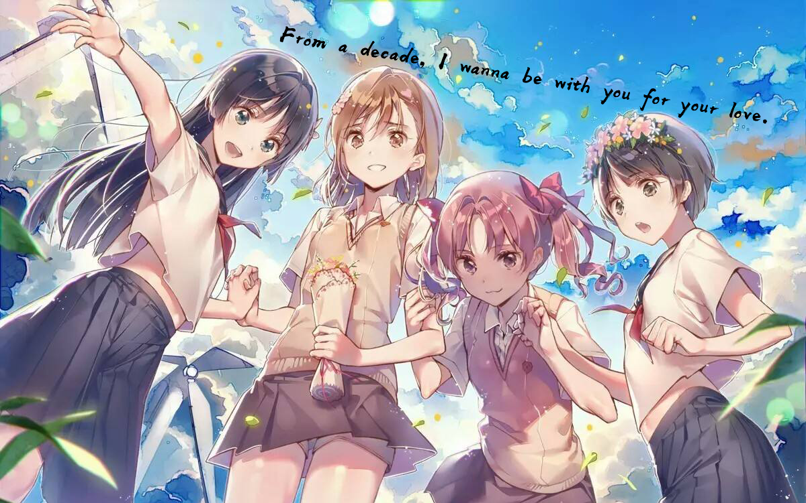

# 👋 你好，我是 Youzhiqing!

  

---

## 📝 关于我

> "代码不仅仅是我们书写的东西，更是我们解决问题、连接世界的方式。"

- **熟练** Python、Vue.js、TypeScript 和 MySQL
- **擅长** 使用 UniApp 和 H5 构建跨平台应用
- **不断探索** 新技术和最佳实践
- **注重细节**，关注代码质量和用户体验
- **终身学习者**，享受解决复杂问题的过程

---

## 📊 LeetCode 统计

  

---

## 🧠 技术栈

  
  
  
  
  
  
  
  

---

## 🔥 贡献活动

  

---

## 📈 访客计数

  
  

---

## 💬 开发者理念

> <h3 align="center">✨ "代码不仅仅是我们书写的东西，更是我们解决问题、连接世界的方式。"</h3>

- 🤝 **贡献**：乐于参与开源，欢迎一起共建有趣的项目
- 🌱 **正在学习**：编译器原理 • 操作系统内核 • 高性能网络通信
- 💬 **可以问我**：全栈开发（前端到后端）• 跨平台客户端（C#、C++、Java、Python）• CI/CD 最佳实践
- ⚡ **趣事**：我相信**优雅的代码是一种艺术**，就像我最喜欢的 ACG 作品一样。我在**高等数学**和创造完美软件架构中都能找到同样的乐趣。

---

## 🚀 核心技术栈

  
  
  
  
  
  
  
  
  
  
  
  

  

---

## 📬 联系我

|                                                                                                                                                        |                                                                                                                                |
| :----------------------------------------------------------------------------------------------------------------------------------------------------: | :-----------------------------------------------------------------------------------------------------------------------------: |
|                                                                                                                                                        |  |
|                                                                                                                                                        |  |
|                                          |      |
|                            |            |
|  |            |

---

## 🎨 我喜欢的插画

  
  
  
  

---

## ❤️ 支持我

  
    
  💖 如果喜欢我的作品，欢迎点个 Star 或关注我！

---

### 感谢访问！🎉

由 **Youzhiqingw** 用 ❤️ 制作

